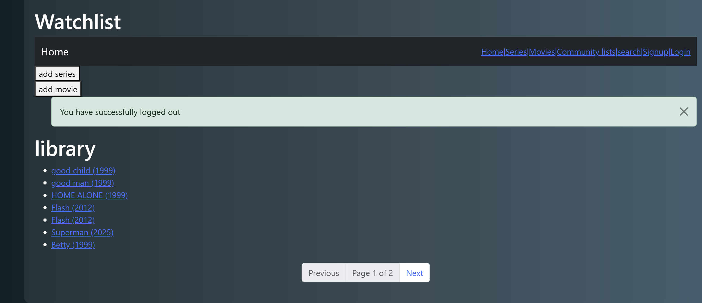
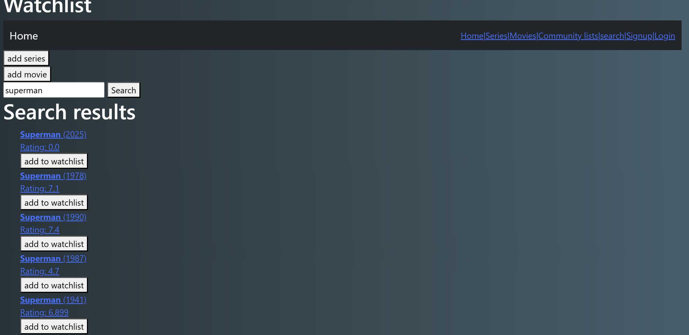
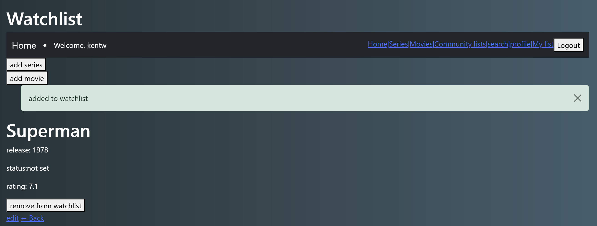
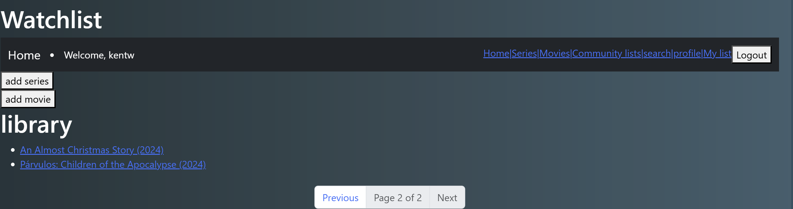
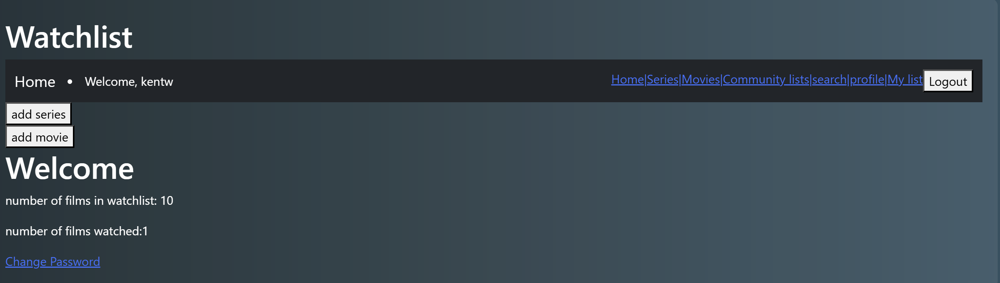

# 🎬 Watchlist App

A personal movie and series tracking app built with Django.

This project lets users keep track of films and shows they’ve watched, are watching, or plan to watch — complete with status updates, ratings, and progress tracking for series.

🚀 **Deployed Application:**  
🔗 [Click here to view the live app](https://watchlist-app-2.onrender.com/)

---

## 🚀 Features

- ✅ **User Authentication**: Signup, login, logout with custom views and feedback flash messages  
- 🎞️ **Movie & Series Library**: Browse, add, edit, and delete items  
- 📝 **Manual Entry Forms**: Users can add movies and series using Django ModelForms  
- 🔁 **CRUD Interface**: Full create, read, update, delete workflow for watchlist entries  
- 🧩 **Template Inheritance**: Shared base templates with clear structure and navigation  
- 🗣️ **Flash Messages**: Feedback upon actions like adding, editing, logging in/out

---

## 🔍 TMDB Search & Pagination (How It Works)
This app integrates with the TMDB API to allow users to search for real movies. To balance performance with API limitations (and keep within free-tier server constraints), search results are handled as follows:

🔎 When a user searches, the app requests only the first page of results (20 items) from TMDB.

📄 These results are stored in the session and paginated locally (e.g., 10 per page).

💾 This approach avoids excessive API calls and keeps server memory usage low on platforms like Render free tier.

⚠️ Note: Only a portion of TMDB’s full search results are shown for now. This is a conscious trade-off to support demo use without hitting TMDB or server limits.

---

## 💡 What I Learned

1. How to customize Django’s auth system with custom views and logout workflows  
2. How Django forms and ModelForms handle validation and defaults  
3. Database design using models, including model inheritance where needed  
4. The power of template inheritance for reusable layouts and navigation  
5. How to implement user feedback flows using flash messages  
6. GitHub workflow: initial commit, feature branches, and project organization
---

## 🛠️ Tech Stack

- **backend:** Django
- **Database:**SQLite (default dev database)
- **Auth:** Django's built-in authentication views
- **frontend** HTML + Django Templates

---
## 📸 Screenshots
 




## ⚙️ Setup Instructions

### 1. Clone the repository

```bash
git clone https://github.com/Quantum-Monarch/watchlist-app.git
cd watchlist-app
```


### 2. Create a virtual environment and activate it
```bash
python -m venv .venv
source .venv/bin/activate  *For Windows: .venv\Scripts\activate
```

### 3. Install dependencies
```bash
pip install -r requirements.txt
```

### 4. Apply migrations
```bash
python manage.py migrate
```

### 5. Run the app
```bash
python manage.py runserver
```
Visit: http://127.0.0.1:8000/

## 📁 Project Structure
```csharp
watchlist-app/
├── watchlist/        # Django app with models, views, urls
├── mysite/           # Project-level settings and configuration
├── templates/        # HTML templates
├── manage.py         # Django’s command-line utility
├── requirements.txt  # List of Python dependencies
├── README.md         # Project overview and instructions
└── LICENSE           # License information

```

##  📌 Notes

The project stores the user’s navigation path to support smoother UX when returning to pages.
The app includes logic to differentiate between movies and series and handle each appropriately.
Fully built using function-based views and session handling,This app integrates with the TMDB API to allow users to search for real movies.

## 🧠 Why I Built This

This started as a personal learning project to dig into Django more deeply. What started simple ended up teaching me a lot about user session handling, model relationships, view logic, forms, and Django’s quirks with redirects. If you’ve ever wanted to scream at a back button, this app will make you feel seen 😂.

## 🙋‍♂️ Author
Kent Woiso — Built this project while learning Django.
Feel free to reach out on GitHub or email if you’re reviewing my portfolio!

## 🪪 License

MIT License — free to use, modify, or build on.