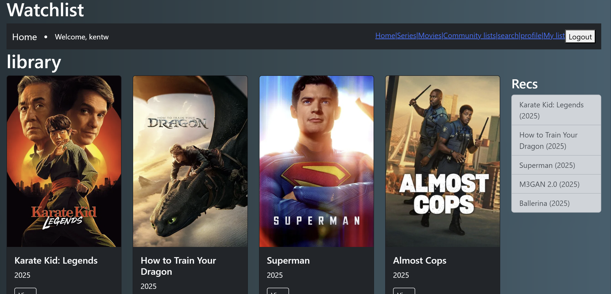
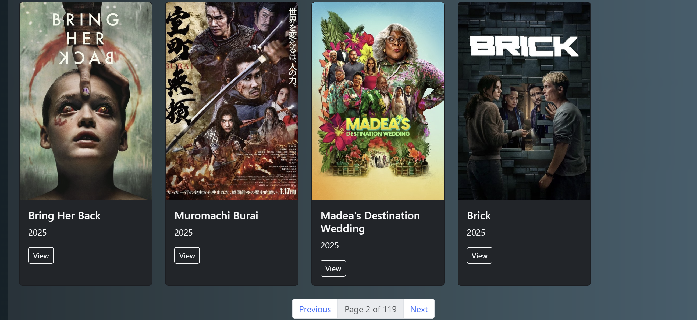
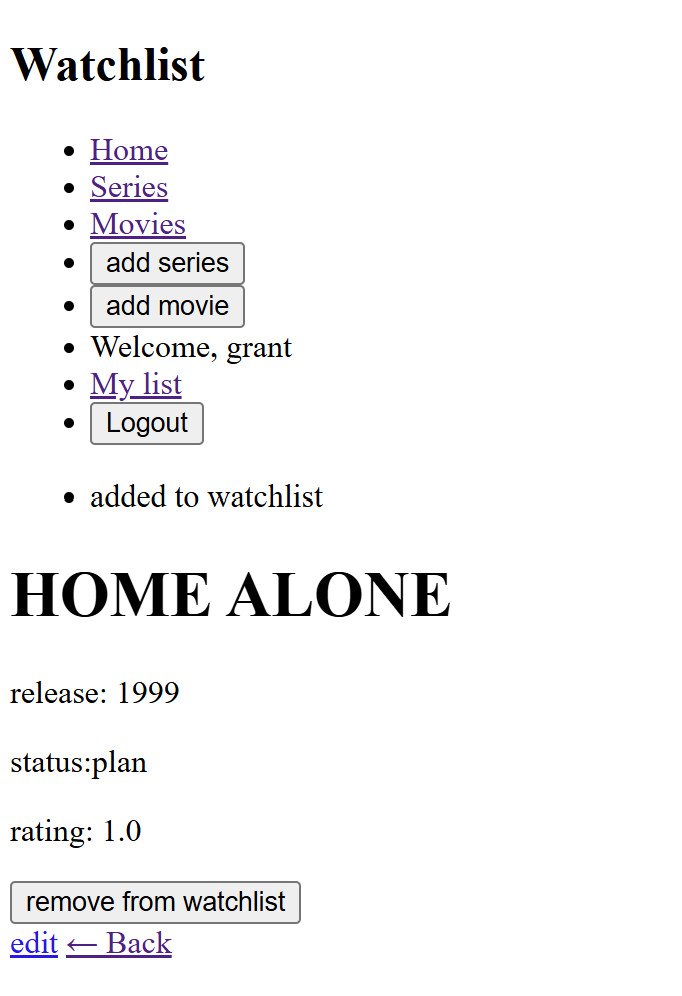
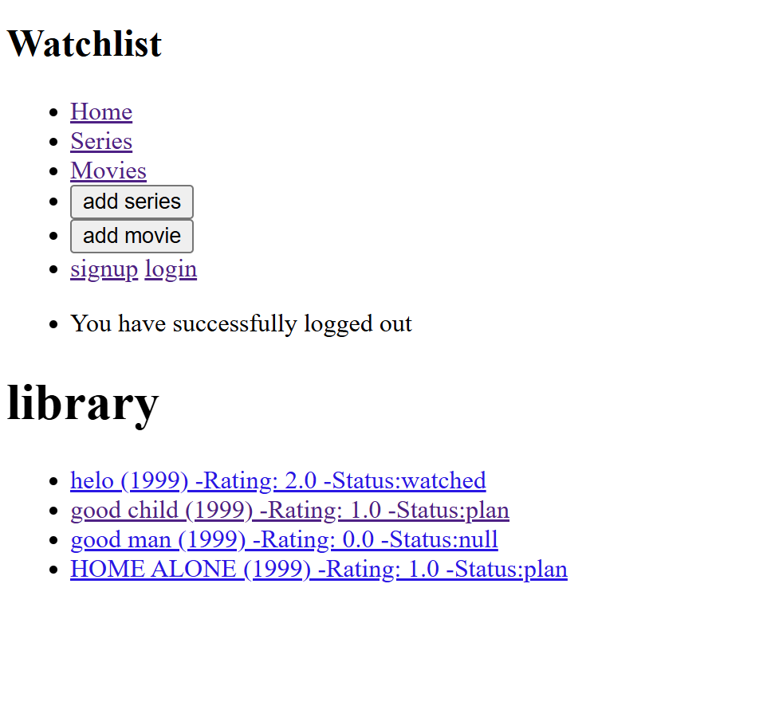
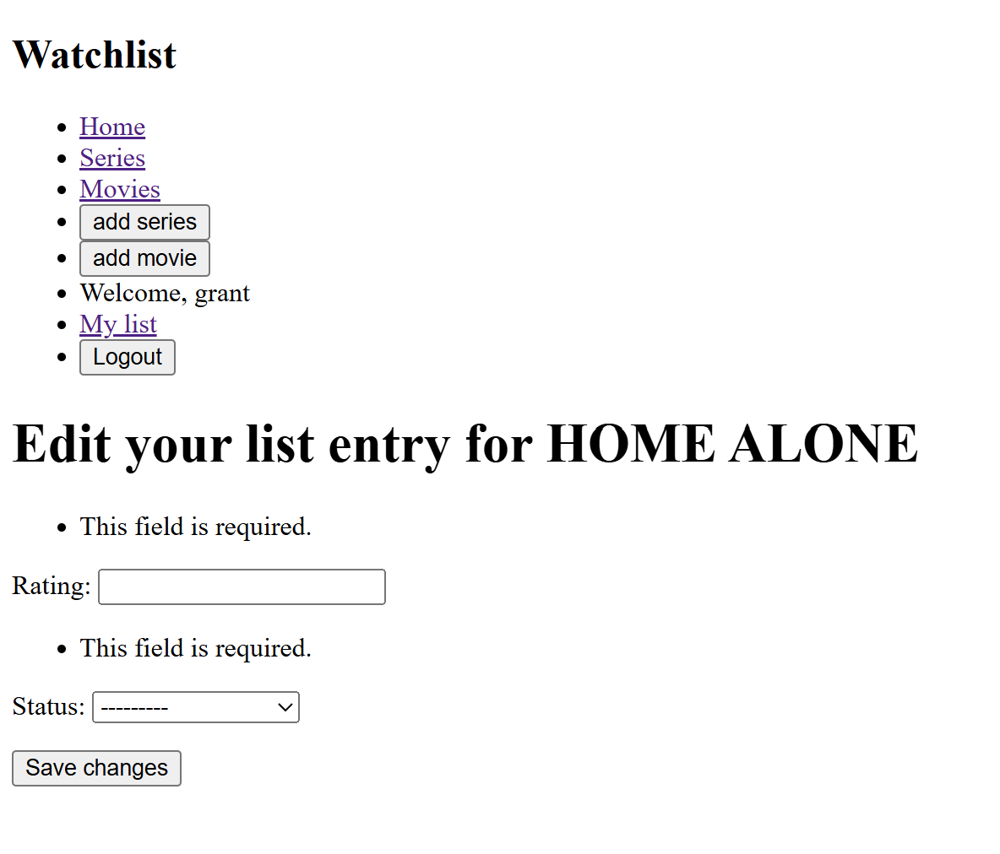

# 🎬 Watchlist App

A personal movie and series tracking app built with Django.

This project lets users keep track of films and shows they’ve watched, are watching, or plan to watch — complete with status updates, ratings, and progress tracking for series.

---

## 🚀 Features

- ✅ User sign up, log in, log out(with custom views and flash messages)
- 🎞️ add user movies or series to collection of films
- ➕ Add/remove items from your personal watchlist
- ✏️ Update watchlist entries
- Edit and delete watchlist entries
- Template inheritance and basic navigation bar
- Flash messages for user feedback
- Separate views for Movies and Series
- Manual form setup using Django ModelForms
- 🔁 Dynamic interface based on watchlist state

---
## 🧠 Purpose and Learning Goals

This app was built as a practical project to reinforce backend web development concepts using Django. Key areas of focus:

- Understanding and customizing authentication with Django's built-in tools
- Designing relational models with inheritance (e.g. `Film` → `Movie` or `Series`)
- Using Django forms to handle user input cleanly
- Applying template inheritance for maintainable layouts
- Managing user feedback via Django’s messages framework

---

## 🛠️ Tech Stack

- **Python 3**
- **backend:** Django
- **Database:**SQLite (default dev database)
- **Auth:** Django's built-in authentication views
- **frontend** HTML + Django Templates

---
## 📸 Screenshots
 




## ⚙️ Setup Instructions

### 1. Clone the repository

```bash
git clone https://github.com/Quantum-Monarch/watchlist-app.git
cd watchlist-app
```


### 2. Create a virtual environment and activate it
```bash
python -m venv .venv
source .venv/bin/activate  *For Windows: .venv\Scripts\activate
```

### 3. Install dependencies
```bash
pip install -r requirements.txt
```

### 4. Apply migrations
```bash
python manage.py migrate
```

### 5. Run the app
```bash
python manage.py runserver
```
Visit: http://127.0.0.1:8000/

## 📁 Project Structure
```csharp
watchlist-app/
├── watchlist/        # Django app with models, views, urls
├── mysite/           # Project-level settings and configuration
├── templates/        # HTML templates
├── manage.py         # Django’s command-line utility
├── requirements.txt  # List of Python dependencies
├── README.md         # Project overview and instructions
└── LICENSE           # License information

```

##  📌 Notes

The project stores the user’s navigation path to support smoother UX when returning to pages.
The app includes logic to differentiate between movies and series and handle each appropriately.
Fully built using function-based views and session handling.

## 🧠 Why I Built This

This started as a personal learning project to dig into Django more deeply. What started simple ended up teaching me a lot about user session handling, model relationships, view logic, and Django’s quirks with redirects. If you’ve ever wanted to scream at a back button, this app will make you feel seen 😂.

## 🙋‍♂️ Author
Kent Woiso — Built this project while learning Django.
Feel free to reach out on GitHub or email if you’re reviewing my portfolio!

## 🪪 License

MIT License — free to use, modify, or build on.